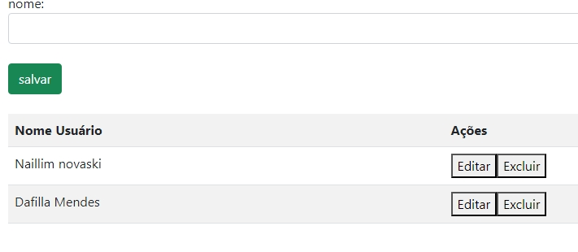

# Sistema de Cadastro de Usuários
 
* [Sistema de Cadastro de Usuários](#sistema-de-cadastro-de-usuários)
* [Descrição](#descrição)
* [Introdução](#introdução)
* [Funcionalidades](#funcionalidades)
* [Tecnologias Utilizadas](#tecnologias-utilizadas)
* [Autores](#autores)
 
## Descrição 📖
Este projeto consiste na criação de um sistema de cadastro de usuários que permite a criação, edição e exclusão de nomes de usuários e seus respectivos e-mails. Na versão mais recente, foi adicionado um campo para cadastro de e-mail com validação para garantir que o e-mail inserido siga o formato adequado, além de validações para garantir que todos os campos obrigatórios sejam preenchidos antes de permitir o cadastro.
 
## Introdução ✉️
O projeto foi desenvolvido para praticar habilidades de desenvolvimento web, incluindo manipulação de DOM com JavaScript e validação de dados de entrada. A atualização recente inclui a adição de uma validação no campo de e-mail, aprimorando a integridade dos dados cadastrados pelos usuários. Além disso, o sistema agora conta com uma validação geral para garantir que todos os campos obrigatórios, como nome e e-mail, sejam preenchidos antes de permitir o cadastro.
 

 
## Funcionalidades 🧠
 
### Validação de Preenchimento
Essa funcionalidade verifica se os campos de e-mail e senha foram preenchidos antes de permitir o acesso ao sistema.
 
javascript
function acessar() {
    let loginEmail = document.getElementById('loginEmail').value;
    let loginSenha = document.getElementById('loginSenha').value;
 
    if (!loginEmail || !loginSenha) {
        alert('Favor preencher todos os campos');
    } else {
        window.location.href = 'cadastro.html';
    }
}
 
 
- *Explicação*:
  - A função acessar valida se os campos de e-mail (loginEmail) e senha (loginSenha) foram preenchidos.
  - Se algum campo estiver vazio, é exibido um alerta solicitando que o usuário preencha todos os campos.
  - Se ambos os campos estiverem preenchidos, o usuário é redirecionado para a página de cadastro.
 
### Criação e Armazenamento de Usuários
Essa funcionalidade permite salvar o nome e e-mail do usuário em uma lista (array) e atualiza a tabela de exibição.
 
javascript
function salvarUser() {
    let nomeUser = document.getElementById('nomeUser').value;
    let emailUser = document.getElementById('emailUser').value;
 
    if (nomeUser && emailUser) {
        dadosLista.push({ nome: nomeUser, email: emailUser });
        criaLista();
        document.getElementById('nomeUser').value = "";
        document.getElementById('emailUser').value = "";
    } else {
        alert("Favor, informar um nome e um e-mail para cadastro");
    }
}
var dadosLista = [];
 
 
- *Explicação*:
  - A função salvarUser obtém os valores dos campos de nome (nomeUser) e e-mail (emailUser).
  - Se ambos os campos estiverem preenchidos, os dados são adicionados ao array dadosLista, e a função criaLista é chamada para atualizar a tabela.
  - Se algum campo estiver vazio, é exibido um alerta solicitando o preenchimento dos campos obrigatórios.
 
### Exibição da Lista de Usuários
Essa funcionalidade gera uma tabela com os nomes e e-mails dos usuários armazenados.
 
javascript
function criaLista() {
    let tabela = "<tr><th>Nome Usuário</th><th>Email</th><th>Ações</th></tr>";
    for (let i = 0; i < dadosLista.length; i++) {
        tabela += `<tr>
            <td>${dadosLista[i].nome}</td>
            <td>${dadosLista[i].email}</td>
            <td>
                <button type='button' onclick='editar(${i})' class='btn btn-warning btn-sm'>Editar</button>
                <button type='button' onclick='excluir(${i})' class='btn btn-danger btn-sm'>Excluir</button>
            </td>
        </tr>`;
    }
    document.getElementById('tabela').innerHTML = tabela;
}
 
 
- *Explicação*:
  - A função criaLista inicializa a tabela com cabeçalhos e percorre todos os elementos do array dadosLista.
  - Para cada usuário na lista, uma linha é adicionada na tabela com o nome, e-mail, e botões para editar e excluir.
 
### Edição de Usuários
Essa funcionalidade permite ao usuário editar o nome e e-mail de um usuário existente na lista.
 
javascript
function editar(i) {
    document.getElementById('nomeUser').value = dadosLista[i].nome;
    document.getElementById('emailUser').value = dadosLista[i].email;
    dadosLista.splice(i, 1);
    criaLista();
}
 
 
- *Explicação*:
  - A função editar coloca o nome e e-mail do usuário selecionado nos campos de entrada para permitir a edição.
  - O nome e e-mail antigos são removidos da lista (dadosLista) para que os novos dados possam ser inseridos.
 
### Exclusão de Usuários
Essa funcionalidade remove um usuário da lista e atualiza a tabela.
 
javascript
function excluir(i) {
    dadosLista.splice(i, 1);
    criaLista();
}
 
 
- *Explicação*:
  - A função excluir remove os dados do usuário do array dadosLista e atualiza a tabela para refletir a remoção.
 
### Validação de E-mail
Essa funcionalidade valida se o e-mail inserido segue o formato correto antes de permitir o cadastro.
 
javascript
function validarEmail(email) {
    const re = /^[a-zA-Z0-9._-]+@[a-zA-Z0-9.-]+\.[a-zA-Z]{2,4}$/;
    return re.test(String(email).toLowerCase());
}
 
 
- *Explicação*:
  - A função validarEmail usa uma expressão regular para verificar se o e-mail segue o formato correto.
  - Se o e-mail não estiver no formato correto, o sistema impede o cadastro até que um e-mail válido seja inserido.
 

## Tecnologias Utilizadas 🖥️
- Visual Studio Code
- HTML5
- CSS3
- JavaScript
- Git
- GitHub
 
## Autores 👥
- [Naillim Novaski](https://github.com/naillimnovaski/login-cad)
- [Dafilla Mendes](https://github.com/mendesdafilla/login-card)